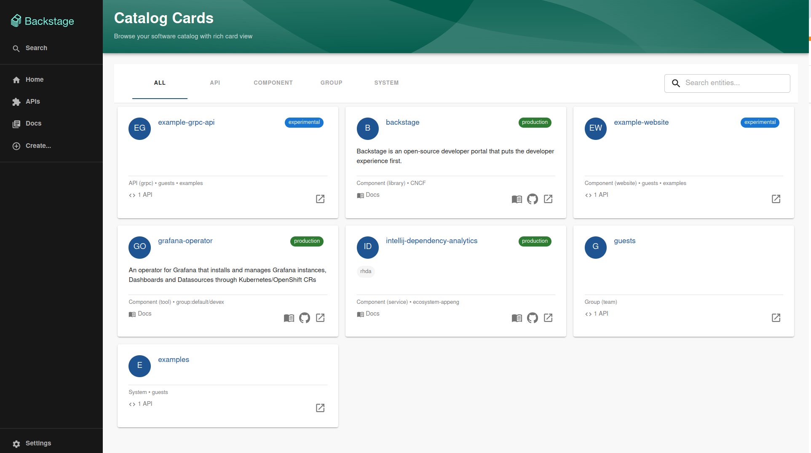

# Catalog Cards Plugin

A Backstage plugin that provides a rich card view for the software catalog with infinite scroll and entity kind filtering.



## Features

- Card-based view for catalog entities with rich metadata display
- Infinite scroll loading for better performance with large catalogs
- Entity kind filtering tabs (All, API, Component, System, etc.)
- Real-time search across entity names, descriptions, tags, and owners
- Configurable entity exclusion via app-config
- Professional design aligned with Backstage demo aesthetics
- Avatar-based entity representation with lifecycle badges
- Responsive design that works across devices
- Integration with existing Backstage entity filtering

## Installation

Add the plugin to your Backstage app:

```bash
yarn add @devexcom/plugin-catalog-cards
```

## Configuration

Configure which entity kinds to exclude from the cards view in your `app-config.yaml`:

```yaml
catalog:
  cards:
    excludeKinds:
      - Location
      - Template
      - User
```

This will hide the specified entity kinds from both the filtering tabs and the entity list.

## Quick Start

### Add to Backstage Navigation

1. **Add to App Routes** - In `packages/app/src/App.tsx`:

```tsx
import { Route } from 'react-router-dom';
import { CatalogCardsPage } from '@devexcom/plugin-catalog-cards';

const routes = (
  <FlatRoutes>
    {/* ... other routes */}
    <Route path="/catalog-cards" element={<CatalogCardsPage />} />
  </FlatRoutes>
);
```

2. **Add Navigation Item** - In `packages/app/src/components/Root/Root.tsx`:

```tsx
import { CatalogIcon } from '@backstage/core-components';

<SidebarGroup label="Menu">
  <SidebarItem icon={CatalogIcon} to="catalog-cards" text="Catalog Cards" />
  {/* ... other navigation items */}
</SidebarGroup>;
```

### Custom Implementation

Replace your existing catalog page or add as a new route:

```tsx
import React from 'react';
import { Page, Header, Content } from '@backstage/core-components';
import { EntityListProvider } from '@backstage/plugin-catalog-react';
import { CatalogCardsContent } from '@devexcom/plugin-catalog-cards';

export const CatalogPage = () => (
  <Page themeId="tool">
    <Header title="Software Catalog" />
    <Content>
      <EntityListProvider>
        <CatalogCardsContent
          pageSize={20}
          density="comfortable"
          enableVirtualization={false}
        />
      </EntityListProvider>
    </Content>
  </Page>
);
```

### Component Props

The `CatalogCardsContent` component accepts these optional props:

- `pageSize` (number): Items loaded per batch, default 50
- `density` ('comfortable' | 'compact'): Card size, default 'comfortable'
- `expandDescriptionsDefault` (boolean): Whether to expand descriptions by default
- `enableVirtualization` (boolean): Enable virtualization for very large lists

### Search Functionality

The plugin includes a real-time search bar that filters entities across:

- Entity names and display names
- Descriptions
- Tags and labels
- Spec types (API, Component, etc.)
- Owner information

The search is case-insensitive and updates results instantly as you type.

## Customization

### Individual Components

You can also use the individual components for custom layouts:

```tsx
import { EntityCard, CatalogCardGrid } from '@devexcom/plugin-catalog-cards';

// Individual entity card
<EntityCard entity={entity} density="compact" />

// Cards grid without filtering
<CatalogCardGrid
  entities={entities}
  loading={false}
  density="comfortable"
/>
```

### Styling

The plugin uses Material-UI theming and will inherit your Backstage theme automatically.

## Troubleshooting

**No entities appear**: Ensure `EntityListProvider` wraps the component and your catalog backend is running.

**React hook errors**: Make sure the plugin is installed as a direct dependency and you're not importing from src files.

**Configuration not working**: Verify your `app-config.yaml` syntax and restart your Backstage instance after changes.
