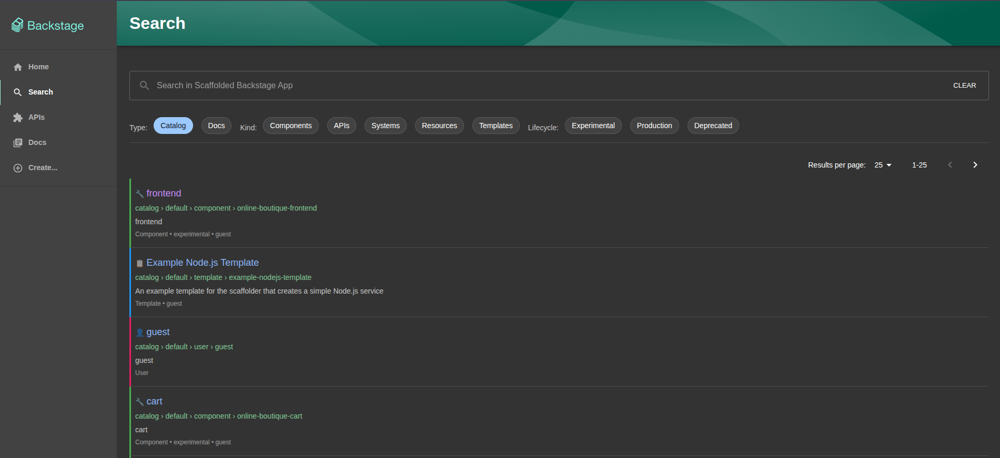

# OpenSearch Frontend Plugin

A modern, Google-like search interface for Backstage that delivers dramatically better search experience compared to the default Lunr-based search.

**📦 Backend Plugin:** [`@devexcom/plugin-search-backend-module-opensearch`](../search-opensearch-backend/README.md)



## Why This Search Interface is Better

The default Backstage search uses Lunr, which works fine for small catalogs but quickly becomes a bottleneck as your organization grows. OpenSearch transforms your search experience from basic text matching to intelligent, fast, and scalable search.

### Detailed Performance Comparison

| Feature          | Lunr (Default)             | OpenSearch                  |
| ---------------- | -------------------------- | --------------------------- |
| **Architecture** | In-memory, single-threaded | Distributed, multi-threaded |
| **Query Time**   | 500ms-2000ms               | Sub-250ms                   |
| **Indexing**     | Full rebuild on restart    | Persistent, incremental     |
| **Scaling**      | Limited by Node.js memory  | Horizontal scaling          |

### Scalability Benefits

| Scale                  | Lunr                 | OpenSearch         |
| ---------------------- | -------------------- | ------------------ |
| **1,000 entities**     | 100MB memory         | 50MB memory        |
| **10,000 entities**    | 1GB+ memory, crashes | Efficient handling |
| **100,000+ entities**  | Not feasible         | Millions supported |
| **Horizontal scaling** | Not supported        | Automatic sharding |

### Enhanced Search Features

| Feature               | Lunr    | OpenSearch                           |
| --------------------- | ------- | ------------------------------------ |
| **Text Highlighting** | None    | Smart `<mark>` highlighting          |
| **Fuzzy Search**      | Limited | Auto-correction                      |
| **Faceted Search**    | None    | By kind, lifecycle, namespace, owner |
| **Ranking**           | Simple  | Advanced relevance scoring           |
| **Field Weighting**   | Equal   | Title boosted over content           |
| **Phrase Search**     | Basic   | Quoted phrases                       |
| **Pattern Matching**  | Limited | Wildcards and prefixes               |

### Search Quality Examples

**Query: "user service"**

_Lunr Results:_

```
1. UserService component
2. Random docs containing "user"
3. Random docs containing "service"
```

_OpenSearch Results:_

```
1. UserService component (exact match, boosted)
2. User-related services (phrase proximity)
3. Service components with user mentions
+ Highlighted matching text
+ Grouped by entity type
+ Relevance scores
```

### Real-World Performance Comparison

| Metric             | Lunr         | OpenSearch | Improvement              |
| ------------------ | ------------ | ---------- | ------------------------ |
| **Query Time**     | 800ms        | 180ms      | **4.4x faster**          |
| **Memory Usage**   | 500MB        | 50MB       | **10x less**             |
| **Startup Time**   | 30s indexing | 2s         | **15x faster**           |
| **Search Quality** | Basic        | Advanced   | **Significantly better** |

### Technical Improvements

| Component          | Lunr                            | OpenSearch                      |
| ------------------ | ------------------------------- | ------------------------------- |
| **Pagination**     | Client-side (loads all results) | Server-side (loads only needed) |
| **Indexing**       | Full rebuild on restart         | Incremental, persistent storage |
| **Error Handling** | Silent failures, hard to debug  | Detailed messages and logging   |
| **Filtering**      | Post-query filtering (slow)     | Native query filtering (fast)   |

### When Should You Switch?

**You definitely need OpenSearch if:**

- Your Backstage catalog has more than 1,000 entities
- Search queries are taking longer than 1 second
- Your backend is running out of memory
- Users complain that search results aren't relevant
- You need to filter search results by entity properties

**You'll appreciate OpenSearch even with smaller catalogs if:**

- You want Google-quality search with highlighting
- Your team expects fast, responsive search
- You plan to grow your Backstage usage
- You want a more professional search experience

## Installation

```bash
yarn add @devexcom/plugin-search-opensearch
```

## Setup

### 1. Replace Search Page

Replace your search page in `packages/app/src/App.tsx`:

**Note:** Remove any existing search page imports first.

```tsx
import { Route } from 'react-router-dom';
import { SearchPage } from '@devexcom/plugin-search-opensearch';

const routes = (
  <FlatRoutes>
    <Route path="/search" element={<SearchPage />} />
  </FlatRoutes>
);
```

### 2. Add Search to Navigation

Add a search link to your sidebar navigation in `packages/app/src/components/Root/Root.tsx`:

```tsx
import { SidebarSearchModal, SidebarItem } from '@backstage/core-components';
import SearchIcon from '@material-ui/icons/Search';

// Replace the search modal with a navigation link
<SidebarItem icon={SearchIcon} to="search" text="Search" />;
```

### 3. Theme Support

This plugin automatically supports both light and dark themes, adapting colors and styling to match your Backstage theme configuration. Search result highlighting and entity colors are optimized for both themes.

## Key Features

- **Smart highlighting** - See exactly what text matched your search
- **Advanced filtering** - Filter by entity type, lifecycle, namespace, owner
- **Fast pagination** - Navigate through results without loading everything
- **Visual entity types** - Color-coded borders and icons for each entity kind
- **Responsive design** - Works great on desktop and mobile
- **Real-time search** - Results update as you type
- **Phrase search** - Use quotes for exact phrase matching
- **Fuzzy search** - Find results even with typos

## Important: Search Modal Limitation

**The Backstage search modal does not work with OpenSearch backends.** This is a known limitation because the modal bypasses custom search engines.

**Solution:** Use this dedicated search page instead of the modal. It provides a much better search experience anyway with features the modal doesn't support.

**How to set up:** Replace your `/search` route to use this plugin (see Setup section below).

## Components

```tsx
import { SearchPage, SearchBar } from '@devexcom/plugin-search-opensearch';

// Full search page with all features
<SearchPage title="Search" />

// Search bar only
<SearchBar placeholder="Search..." />
```

## When Should You Use This?

**You definitely need this plugin if:**

- You're using the OpenSearch backend plugin
- Users complain that search doesn't find relevant results
- You have more than 500 entities in your catalog
- You want professional search like Google/Slack/Confluence

**You'll appreciate this plugin even with default search if:**

- You want better visual design and UX
- You need filtering by entity properties
- You want search result highlighting
- Your team expects modern search interfaces

## Setup for OpenSearch Backend

This plugin works best with the OpenSearch backend. To get the full benefits:

1. Install the backend plugin: [`@devexcom/plugin-search-backend-module-opensearch`](../search-opensearch-backend/README.md)
2. Configure OpenSearch in your `app-config.yaml`
3. Replace your search page with this plugin
4. Enjoy dramatically better search performance and experience

See the [backend plugin README](../search-opensearch-backend/README.md) for complete setup instructions.

```

```
